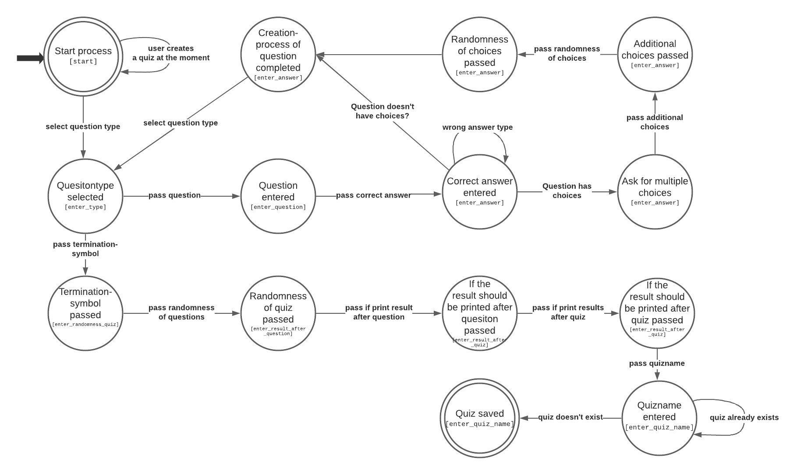
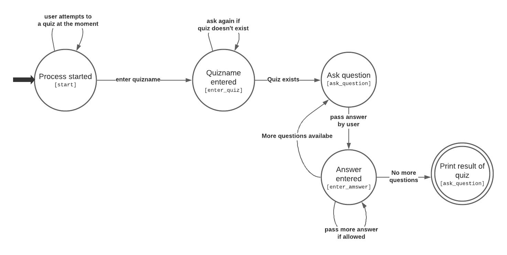
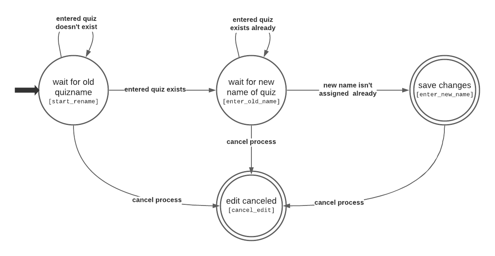
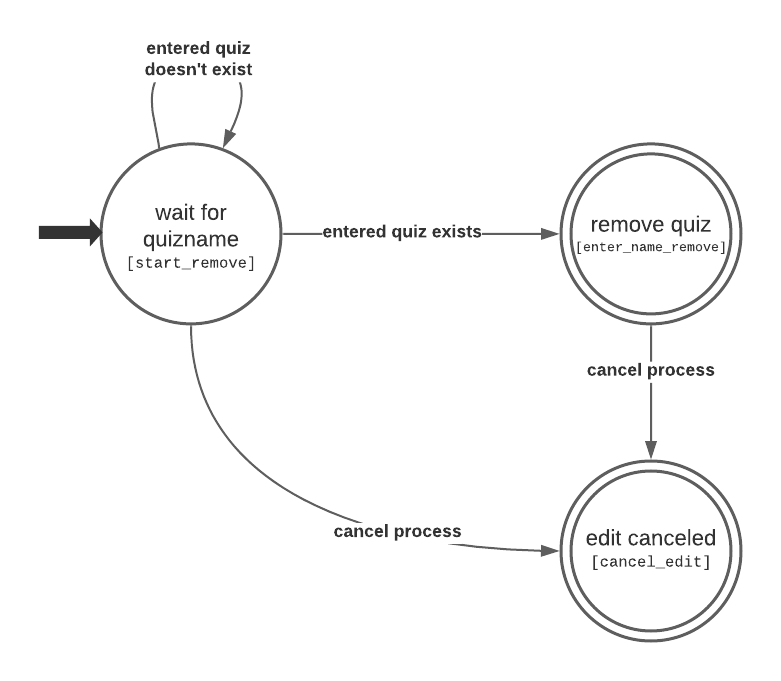

.. _Telegram Bot:

Telegram bot
============
The telegram bot is using the quiz foundation and it has three main functions:
- creating a quiz,
- attempt a quiz,
- edit data at database.

Every one of them uses a `ConversationHandler` and their way to work is specified in:
- `bot.create_quiz.py`,
- `bot.attempt_quiz.py`,
- `bot.edit_quiz.py`.

The best way to show their way to work is by using an automata diagram. You can cancel the process during the creation and attempt like in the renaming and removing process.

  The automata of the process to create a new quiz

  The automata of the process to attempt to a quiz

  The automata of the process to rename an existing quiz

  The automata of the process to remove an existing quiz

The rename- and remove-process takes place in `bot.edit_quiz.py`. Saving, loading, renaming and deleting a quiz works with mongoDB